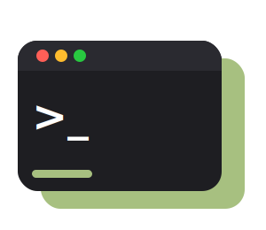

<div align="center">
  
  <h1>Termd</h1>
  <p><strong>个人使用的可信 relay 持久终端。</strong></p>
</div>

Termd 让一台机器上的 shell session 由 session supervisor 持久托管，并通过浏览器长期存在：client 断开后可以重新 attach，多个已配对设备默认 shared-control，可以同时操作同一个终端。

项目定位是个人使用：单用户、设备级信任、轻量 relay，不做企业权限平台。

## Features

- supervisor-owned 持久 session：每个 session 由独立 supervisor 托管真实 PTY、terminal journal、attach heartbeat 和超时关闭；daemon 只维护 session catalog、workspace/file/git API 和 attach proxy。
- Web UI：内嵌终端、session 管理、文件面板、daemon 管理和 PWA；终端渲染只使用 `ghostty-web`。
- 多客户端 shared-control：已配对设备都是 operator，可同时 attach 同一个 session。
- 设备级 pairing/auth：短期 pairing token、device key、challenge-response、timestamp/nonce replay protection。
- 明文业务协议：去掉运行时 E2EE 后，pairing/auth/session/file 仍由 `termd` 校验和持有，线上路径更短。
- 可信 Relay：`termrelay` 用 transport token 和 daemon registry 做入口控制，一个 relay 可服务多个已注册 daemon。
- Web-first client：Web 是正式交互客户端；`termctl` 保留为配对/调试工具。
- 一键安装：`termd`、`termrelay` 支持 curl/wget；`termd` 和 `termrelay` 支持 systemd。

## 使用方式

Release 由 tag 驱动；固定版本时把 URL 里的 `latest` 换成对应 tag。

### daemon + Web

个人机器推荐指定运行用户，这样 Web 新建 session 会使用该用户的 HOME 和 login shell：

```bash
curl -fsSL https://github.com/yiiilin/termd/releases/latest/download/install-termd.sh | sudo bash -s -- --web --listen 0.0.0.0:8765 --user "$USER"
```

只本机访问可以去掉 `--listen 0.0.0.0:8765`；只想用默认受限用户可以去掉 `--user "$USER"`。

安装脚本会注册并启动 `termd.service`，然后打印一次性 `termd-pair:v2:<base64url>` 邀请码。邀请码过期或用过后，在 daemon 主机重新签发：

```bash
termd pair --qr
```

常用配置集中在 `/etc/termd/termd.env`，修改后执行 `sudo systemctl restart termd`：

```dotenv
HOME=/home/alice
SHELL=/bin/bash
TERMD_LISTEN=0.0.0.0:8765
TERMD_WEB_ENABLED=1
TERMD_RELAY_URLS=wss://relay.example
TERMD_RELAY_AUTH_TOKEN_FILE=/etc/termd/termd_relay_token
TERMD_RELAY_DAEMON_TOKEN_FILE=/etc/termd/termd_daemon_token
```

当前 daemon identity、SQLite 状态库和 supervisor runtime 元数据固定在 `/var/lib/termd`，不随 `--user` 改变。

### CLI / debug

```bash
curl -fsSL https://github.com/yiiilin/termd/releases/latest/download/install-termctl.sh | sudo bash
```

`termctl` 不是正式交互 attach 客户端；它只保留配对、诊断和后续调试入口。

### Relay

部署 relay：

```bash
curl -fsSL https://github.com/yiiilin/termd/releases/latest/download/install-termrelay.sh | sudo bash -s -- --web --listen 0.0.0.0:8080 --auth-token-file /etc/termd/termrelay_auth_token --daemon-registry /etc/termd/termrelay-daemons.json
```

先把 relay transport token 写入服务用户可读的 secret 文件，例如 `/etc/termd/termrelay_auth_token`，避免 token 出现在 systemd argv 或进程列表中；systemd 下该文件需要对 `termrelay` 用户或组可读。

让 daemon 连接 relay：

```bash
curl -fsSL https://github.com/yiiilin/termd/releases/latest/download/install-termd.sh | sudo bash -s -- --relay wss://relay.example --relay-auth-token-file /etc/termd/termd_relay_token --relay-daemon-token-file /etc/termd/termd_daemon_token
```

`termrelay --auth-token-file` 和 `termd --relay-auth-token-file` 是 client/daemon 连接 relay 的 transport token；`termd --relay-daemon-token-file` 是 daemon 在 route prelude 中提交给可信 relay 的 daemon token。两者可以分开轮换。daemon registry JSON 用 `server_id -> token` 注册允许接入的 daemon，示例见 [docs/deployment.md](docs/deployment.md)。

同一份 `termd pair --qr` 邀请码可用于 daemon Web 和 relay Web。relay 做 admission 和路由，pairing/auth/session 权限仍由 daemon 最终校验。Docker Compose 部署见 [docs/deployment.md](docs/deployment.md)。

没有 curl 时，把上面的 `curl -fsSL URL | sudo bash -s -- ...` 换成 `wget -qO- URL | sudo bash -s -- ...`。

### Uninstall

```bash
curl -fsSL https://github.com/yiiilin/termd/releases/latest/download/install-termd.sh | sudo bash -s -- --uninstall
curl -fsSL https://github.com/yiiilin/termd/releases/latest/download/install-termrelay.sh | sudo bash -s -- --uninstall
curl -fsSL https://github.com/yiiilin/termd/releases/latest/download/install-termctl.sh | sudo bash -s -- --uninstall
```

默认保留 `/var/lib/termd` / `/var/lib/termrelay`。连本地状态和 system user 一起删除：

```bash
curl -fsSL https://github.com/yiiilin/termd/releases/latest/download/install-termd.sh | sudo bash -s -- --uninstall --purge
curl -fsSL https://github.com/yiiilin/termd/releases/latest/download/install-termrelay.sh | sudo bash -s -- --uninstall --purge
```

## License

MIT. See [LICENSE](LICENSE).
